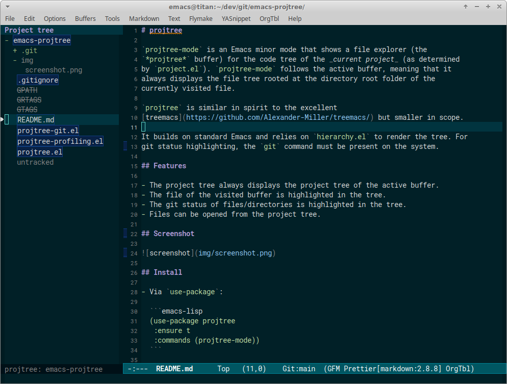

# projtree

`projtree-mode` is an Emacs minor mode that shows a file explorer (the
`*projtree*` buffer) for the code tree of the _current project_ (as determined
by `project.el`). `projtree-mode` follows the active buffer, meaning that it
always displays the file tree rooted at the directory root folder of the
currently visited file.

`projtree` is similar in spirit to the excellent
[treemacs](https://github.com/Alexander-Miller/treemacs/) but smaller in scope.

It builds on standard Emacs and relies on `hierarchy.el` to render the tree. For
git status highlighting, the `git` command must be present on the system.

## Features

- The project tree always displays the project tree of the active buffer.
- The file of the visited buffer is highlighted in the tree.
- The git status of files/directories is highlighted in the tree.
- Files can be opened from the project tree.

## Screenshot



## Install

- Via `use-package`:

  ```emacs-lisp
  (use-package projtree
   :ensure t
   :commands (projtree-mode))
  ```

- Via `use-package` and `straight.el`:

  ```emacs-lisp
  (use-package projtree
    :straight (emacs-projtree :type git :host github
                  :repo "petergardfjall/emacs-projtree")
    :commands (projtree-mode))
  ```

- By adding `projtree.el` to your `~/.emacs.d/lisp/`:

  ```emacs-lisp
  (add-to-list 'load-path "~/.emacs.d/lisp/")
  (require 'projtree)
  ```

After getting `projtree.el` onto your Emacs load-path just issue the
`M-x projtree-mode` command.

## Customization

Variables:

- `projtree-window-width`: Initial width (in characters) to use for the project
  tree buffer (the window size can be adjusted at any time).
- `projtree-window-placement`: The placement of the project tree window: `'left`
  or `'right`. Default: `'left`.
- `projtree-show-git-status`: Whether to show git status for project tree files
  and folders. Default: `t`.
- `projtree-buffer-name`: The name to use for the project tree buffer. Default:
  `*projtree*`.
- `projtree-profiling-enabled`: Whether to output performance profiling.
  Default: `nil`.

Faces:

- `projtree-highlight`: Face for highlighting the visited file in the project
  tree.
- `projtree-dir`: Face for highlighting unmodified folders in the project tree.
- `projtree-file`: Face for highlighting unmodified files in the project tree.
- `projtree-git-modified`: Face for highlighting modified files and folders in
  the project tree.
- `projtree-git-added`: Face for highlighting added files in the project tree.
- `projtree-git-renamed`: Face for highlighting renamed files in the project
  tree.
- `projtree-git-ignored`: Face for highlighting ignored files in the project
  tree.
- `projtree-git-untracked`: Face for highlighting untracked files in the project
  tree.
- `projtree-git-conflict`: Face for highlighting files with unresolved conflicts
  in the project tree.

## Keybindings

The project tree buffer defines a local keymap `projtree-buffer-map`. Currently
it comes with the following bindings:

- `d`: opens a `dired` window for the parent directory of the file at point in
  the project tree buffer.
- `g`: refresh the project tree (`projtree-open`). Doing this will refresh the
  git status when `projtree-show-git-status` is `t`.
