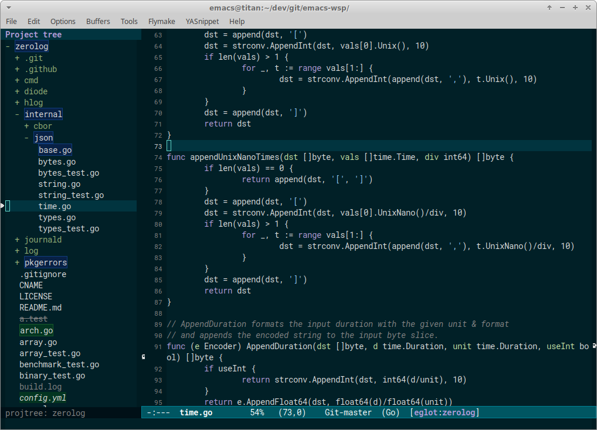

# projtree

`projtree-mode` is an Emacs minor mode that shows a file explorer (the
`*projtree*` buffer) for the code tree of the _current project_ (as determined
by `project.el`). `projtree-mode` follows the active buffer such that it always
displays the file tree rooted at the project root folder of the currently
visited file.

`projtree` is similar in spirit to the excellent
[treemacs](https://github.com/Alexander-Miller/treemacs/) but smaller in scope.
It builds on standard Emacs and relies on `hierarchy.el` to render/explore the
directory tree. For git status highlighting, the `git` command must present on
the system.

## Features

- The project tree always displays the project tree of the active buffer.
- The file of the visited buffer is highlighted in the tree.
- The git status of files/directories is highlighted in the tree.
- Files can be opened from the project tree.

## Screenshots

The below image illustrates what the `*projtree*` buffer (on the left-hand side)
could look like. Some of the faces have been [customized](#customization) via
the
[immaterial theme](https://github.com/petergardfjall/emacs-immaterial-theme).



## Install

- Via `use-package`:

  ```emacs-lisp
  (use-package projtree
   :ensure t
   :commands (projtree-mode))
  ```

- Via `use-package` and `straight.el`:

  ```emacs-lisp
  (use-package projtree
    :straight (emacs-projtree :type git :host github
               :repo "petergardfjall/emacs-projtree")
    :commands (projtree-mode))
  ```

- By adding `projtree.el` to your `~/.emacs.d/lisp/`:

  ```emacs-lisp
  (add-to-list 'load-path "~/.emacs.d/lisp/")
  (require 'projtree)
  ```

After getting `projtree.el` onto your Emacs load-path just issue the
`M-x projtree-mode` command.

## Customization

**Variables**:

- `projtree-window-width`: The width in characters to use for the project tree
  buffer. Default: `30`.
- `projtree-window-placement`: Placement of project tree window. Default
  `'left`.
- `projtree-show-git-status`: Enable git status for project tree files and
  folders. Default: `t`.
- `projtree-buffer-name`: The name to use for the project tree buffer. Default:
  `*projtree*`.
- `projtree-profiling-enabled`: Whether to output performance profiling. Default
  `nil`.

**Faces**:

- `projtree-highlight`: used to highlight the visited file in the project tree.
- `projtree-dir`: used to highlight unmodified folders in the project tree.
- `projtree-file`: used to highlight unmodified files in the project tree.
- `projtree-git-modified`: used to highlight modified files (and folders) in the
  project tree.
- `projtree-git-added`: used to highlight added files in the project tree.
- `projtree-git-renamed`: used to highlight renamed files in the project tree.
- `projtree-git-ignored`: used to highlight ignored files (matched by
  `.gitignore` entries) in the project tree.
- `projtree-git-untracked`: used to highlight files not (yet) under version
  control.
- `projtree-git-conflict`: used to highlight files with unresolved conflicts in
  the project tree.

**Keybindings**:

The project tree buffer defines a local keymap `projtree-buffer-map`. Currently
it comes with the following bindings:

- `g`: refresh the project tree (`projtree-open`). Doing this will refresh the
  git status when `projtree-show-git-status` is `t`.
